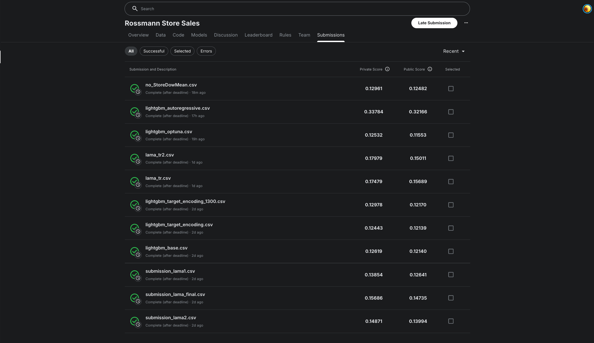
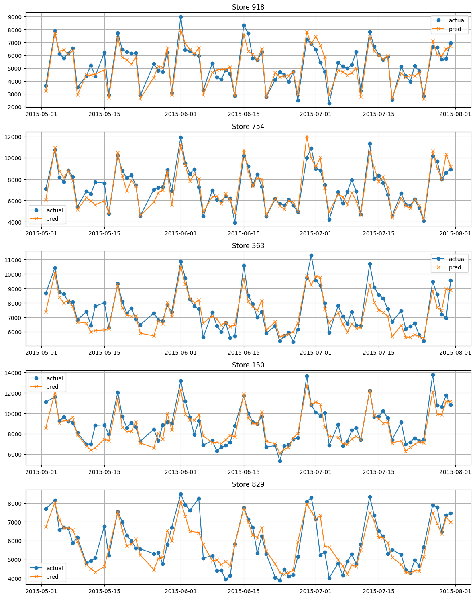

# Rossmann Store Sales Prediction

Прогнозирование продаж для сети магазинов Rossmann с использованием LightGBM и ручного подбора фичей.

## Результаты

Собственное решение с ручным инжинирингом фичей побило LightAutoML бейзлайны на 12%:
- **LAMA baseline**: 0.139 RMSPE (private)
- **Мое решение**: 0.124 RMSPE (private)



## Структура репозитория

```
.
├── Rossman full research.ipynb  # основной ноутбук с полным исследованием
├── data/                        # исходные данные Kaggle
│   ├── train.csv
│   ├── test.csv
│   ├── store.csv
│   └── sample_submission.csv
├── submissions/                 # файлы сабмитов на Kaggle
│   ├── lightgbm_base.csv
│   ├── lightgbm_target_encoding.csv
│   └── lama_*.csv              # бейзлайны LightAutoML
└── src/
    ├── submitsScreen.png       # скриншот метрик с Kaggle
    └── timeSriesPrediction.png # пример прогноза для 5 магазинов
```

## Основной ноутбук

`Rossman full research.ipynb` содержит:
1. **EDA** — разведочный анализ данных, выявление паттернов и аномалий
2. **Feature Engineering** — создание 50+ признаков на основе гипотез из EDA
3. **Гипотезы** — 16 гипотез о влиянии признаков на продажи (12 подтвердились, 4 провалились)
4. **Бейзлайны** — 3 модели LightAutoML для сравнения
5. **Мои модели** — 2 LightGBM модели с разными наборами признаков
6. **Итоговые выводы** — анализ важности признаков и эффективности моделей

## Ключевые находки

**Топ-5 признаков**:
- `StoreDowMean` (755k importance) — средние продажи по магазину и дню недели
- `MonthRatio` (131k) — отклонение магазина от нормы типа в текущем месяце
- `PromoDow` (114k) — interaction промо и дня недели
- `WeekDowMean` (58k) — микросезонность конкретных недель года
- `Store` (74k) — уникальность каждого магазина

**Что не работает**:
- Duration признаки конкуренции (CompetitionOpen, NewCompetition)
- Разложение PromoInterval на отдельные месяцы
- Бинарные флаги комбинаций (DangerousComp, SafeComp)
- Лаги таргета и специализация моделей по типам магазинов

## Установка

```bash
uv sync
```

## Данные

Датасет Rossmann Store Sales с Kaggle:
- 1.017M записей продаж за 2013-2015
- 1115 магазинов
- 22 исходных признака

## Примеры предсказаний для отдельных магазинов на валидации

